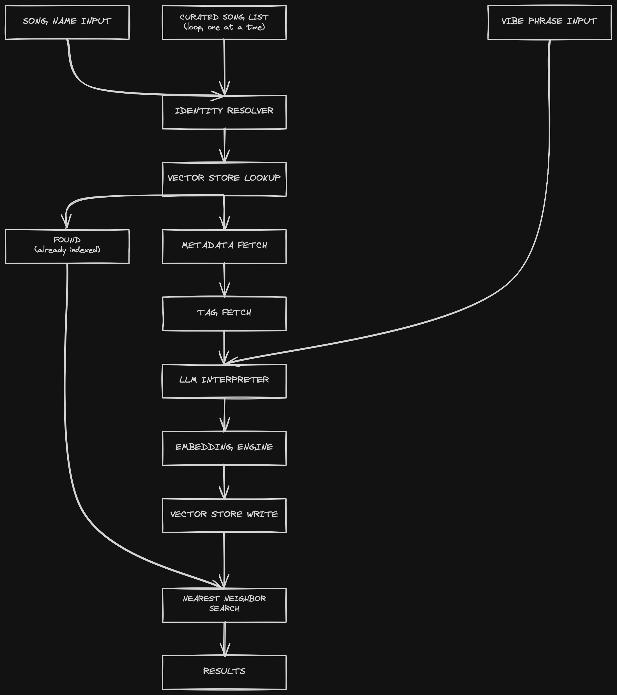

# vibeMax — Workflow

Search by mood/situation instead of genre or artist.

Three entry points feed the same underlying pipeline: a live song-name
search, a live vibe-phrase search, and the offline bulk seed script. The
seed script and the song-name "cold start" branch call the exact same
build function — not two separate implementations.

